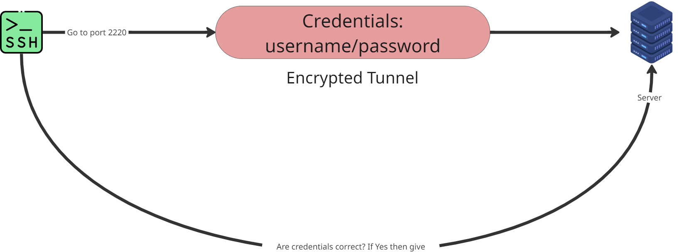

# How SSH actually works

This week, playing through Bandit labs 0–5, I finally understood SSH (Secure Shell). The way I picture it now: SSH is a messenger that carries your credentials **to** the server — not the other way around.

Here's the part that clicked for me: the messenger doesn't just walk up and hand over your username and password. First, your machine and the server build a secure, **encrypted tunnel** between them. Only then do the credentials travel through it. Anyone watching the network in between just sees scrambled noise.

Two practical things I learned:

- **The port matters.** Bandit listens on port 2220, not the default 22. Connect to the wrong port and there's nothing there to answer — or a firewall drops you. Always check which port the service actually lives on.
- **Authentication happens inside the tunnel.** The server checks your credentials and either hands you a shell or rejects you. Encryption first, credentials second — that's the whole reason your password isn't exposed on the network.
